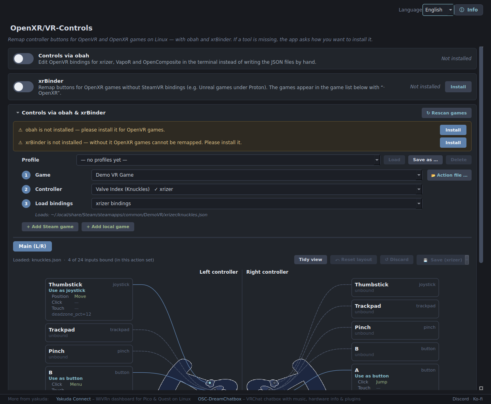

<p align="center">
  
</p>

<h1 align="center">OpenXR/VR-Controls</h1>

<p align="center">
  <b>Remap your VR controller buttons on Linux — for OpenVR <i>and</i> OpenXR games, with a real UI.</b><br>
  <sub>No JSON editing, no terminal tools. Pick a game, click a button, choose what it does.</sub>
</p>

<p align="center">
  <a href="https://discord.gg/ShNKvvZu74"></a>
  <a href="https://ko-fi.com/yakuda_"></a>
  
  
</p>

<p align="center">
  <a href="#-english">English</a> · <a href="#-deutsch">Deutsch</a>
</p>

<p align="center">
  
</p>

---

## 🇬🇧 English

### Who is this for?

For everyone playing VR on Linux **without** a Pico or Quest — Valve Index, HTC Vive and other headsets on **SteamVR** or **Monado**. It's the Controls tab from [Yakuda Connect](https://github.com/yakuda-stack/yakuda-connect) as a small standalone app. (Using a Pico/Quest with WiVRn? Then Yakuda Connect already has all of this built in.)

### ✨ Features

| | |
|---|---|
| 🎮 **One controller view** | Both controllers side by side, one card per button. Click a card to change what it does. |
| 🕹️ **OpenVR games** | Bindings via [obah](https://github.com/galister/obah) for xrizer, VapoR and OpenComposite. Profiles, poses, haptics and chords included. |
| 🧩 **OpenXR games** | E.g. Unreal games under Proton, via [xrBinder](https://gitlab.com/mittorn/xrBinder). Start the game once and it shows up in the list as `· OpenXR`. |
| ◎ **Deadzone against stick drift** | A slider for each stick, in OpenXR *and* OpenVR games. |
| ➕ **Add games yourself** | *Add Steam game* for titles that aren't detected as VR, *Add local game* for games without Steam (itch.io, GOG, your own builds). |
| 🔧 **Installs its own tools** | obah and xrBinder via Cargo or yay/paru, in a visible terminal so you can follow every step. |
| 🤝 **Works alongside Yakuda Connect** | If Yakuda Connect already built xrBinder or obah, that installation is reused. |
| 🌍 **English / Deutsch** | Follows your system language and can be switched at the top right. |

<table>
  <tr>
    <td align="center"><b>OpenVR game (obah)</b><br></td>
    <td align="center"><b>OpenXR game (xrBinder)</b><br></td>
  </tr>
</table>

<p align="center">
  
</p>

> **Note on the OpenVR deadzone:** it is saved as `deadzone_pct` in the binding file. xrizer doesn't evaluate that value yet. For xrizer games, switch on xrBinder and use the deadzone of the game's `· OpenXR` entry instead.

### 🚀 Getting started

| | |
|---|---|
| **AUR** (Arch / CachyOS) | `yay -S openxr-vr-control` |
| **AppImage** (any distro) | Download from [Releases](https://github.com/yakuda-stack/OpenXR-VR-Control/releases), `chmod +x`, start |
| **Installer** (Arch, Fedora, Debian/Ubuntu, openSUSE) | `bash <(curl -s https://raw.githubusercontent.com/yakuda-stack/OpenXR-VR-Control/main/install.sh)` |
| **From source** | `sudo pacman -S pyside6` (or `pip install -r requirements.txt`), then `python3 starter.py` |

1. Switch on **obah** (for OpenVR games) and/or **xrBinder** (for OpenXR games). If a tool is missing, the app asks how to install it.
2. Under **① Game**, pick your game. Missing? Use **+ Add Steam game** / **+ Add local game**.
3. Under **② Controller**, pick your controller and under **③ Load bindings**, pick where to start from.
4. Click the buttons you want to change, then press **Save**.

### 📁 Where things are stored

| Path | Content |
|---|---|
| `~/.config/openxr-vr-control/` | settings, your game list, tool builds |
| `~/.cache/openxr-vr-control/app.log` | log (also reachable via **ⓘ Info → Open log folder**) |
| `~/.config/xrBinder/` | xrBinder config, shared with Yakuda Connect on purpose |

### 🧪 Development

```bash
QT_QPA_PLATFORM=offscreen python3 -m pytest -q tests
ruff check .
```

How the code is organised (and which parts come from Yakuda Connect) is described in [`ARCHITEKTUR.md`](ARCHITEKTUR.md).

---

## 🇩🇪 Deutsch

### Für wen?

Für alle, die unter Linux VR spielen, aber **keine** Pico oder Quest haben: Valve Index, HTC Vive und andere Headsets unter **SteamVR** oder **Monado**. Es ist der Controls-Tab aus [Yakuda Connect](https://github.com/yakuda-stack/yakuda-connect) als kleines eigenes Programm.

### ✨ Funktionen

- 🎮 **Eine Controller-Ansicht:** beide Controller nebeneinander, je Taste eine Karte. Klick auf eine Karte, um die Belegung zu ändern.
- 🕹️ **OpenVR-Spiele** über obah (xrizer, VapoR, OpenComposite), 🧩 **OpenXR-Spiele** über xrBinder.
- ◎ **Deadzone gegen Stick-Drift**, bei OpenXR- und OpenVR-Spielen.
- ➕ **Steam-Spiel / Lokales Spiel hinzufügen**, wenn ein Spiel nicht automatisch erkannt wird.
- 🔧 **Installiert obah und xrBinder selbst** (Cargo oder yay/paru).
- 🤝 **Nutzt vorhandene Installationen aus Yakuda Connect mit.**
- 🌍 **Deutsch / Englisch**

### 🚀 Start

- **AUR:** `yay -S openxr-vr-control`
- **AppImage:** aus den [Releases](https://github.com/yakuda-stack/OpenXR-VR-Control/releases) laden, ausführbar machen, starten
- **Installer:** `bash <(curl -s https://raw.githubusercontent.com/yakuda-stack/OpenXR-VR-Control/main/install.sh)`
- **Aus dem Quellcode:** `sudo pacman -S pyside6`, dann `python3 starter.py`

1. **obah** und/oder **xrBinder** einschalten. Fehlt ein Werkzeug, fragt die App, wie es installiert werden soll.
2. Unter **① Spiel** das Spiel wählen. Fehlt es, über **+ Steam-Spiel** oder **+ Lokales Spiel** hinzufügen.
3. Unter **② Controller** den Controller wählen, unter **③ Bindings laden** den Ausgangspunkt.
4. Tasten anklicken, belegen und **Speichern**.

> Die Deadzone bei OpenVR-Spielen wird als `deadzone_pct` gespeichert. xrizer wertet diesen Wert noch nicht aus. Bei xrizer-Spielen deshalb xrBinder einschalten und die Deadzone im `· OpenXR`-Eintrag einstellen.

---

## 💜 More from yakuda

| | |
|---|---|
| **[Yakuda Connect](https://github.com/yakuda-stack/yakuda-connect)** | WiVRn dashboard for Pico & Quest on Linux: streaming, games, tools and controls in one app |
| **[OSC-DreamChatbox](https://github.com/yakuda-stack/OSC-DreamChatbox)** | VRChat chatbox with music, hardware info, speech-to-text & plugins, for Linux and Windows |

## 🙏 Thanks

[obah](https://github.com/galister/obah) by galister · [xrBinder](https://gitlab.com/mittorn/xrBinder) by mittorn · [xrizer](https://github.com/Supreeeme/xrizer)

<p align="center"></p>

---

<p align="center"><sub>🤖 <b>Transparency note:</b> This project and its documentation are developed with the support of AI coding assistants (<b>Claude by Anthropic</b>). <b>Idea, architecture &amp; UX/UI design:</b> by me. The controls code comes from Yakuda Connect.</sub></p>
<p align="center"><sub>Licensed under GPL-3.0</sub></p>
